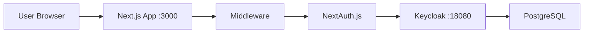

# Next.js Keycloak Authentication Demo

🔐 **A complete authentication demo using Next.js and Keycloak with OpenID Connect (OIDC)**

This project demonstrates how to integrate Keycloak authentication with a Next.js application using NextAuth.js, showcasing a full OIDC authentication flow with PKCE security.


## 🎯 Features

- **🔐 OIDC Authentication**: Complete OpenID Connect flow with Keycloak
- **🛡️ PKCE Security**: Proof Key for Code Exchange implementation
- **🍪 JWT Sessions**: Secure session management with HTTP-only cookies
- **🛣️ Route Protection**: Automatic redirect for unauthenticated users
- **📱 Responsive UI**: Mobile-friendly interface with Tailwind CSS
- **🔄 Auto Redirect**: Seamless login/logout experience
- **👤 User Info Display**: Shows authenticated user details

## 🚀 Quick Start

### Prerequisites

- **Node.js** 18+ 
- **Docker & Docker Compose**
- **Git**

### 1. Clone the Repository

```bash
git clone <repository-url>
cd nextjs-keycloak-demo
```

### 2. Start Keycloak Server

```bash
# From the project root directory
docker compose up -d
```

This will start:
- **Keycloak** on `http://localhost:18080`
- **PostgreSQL** database for Keycloak

### 3. Install Dependencies

```bash
npm install
```

### 4. Start Next.js Development Server

```bash
npm run dev
```

The application will be available at `http://localhost:3000`

## 🧪 Testing the Application

1. **Access the App**: Navigate to `http://localhost:3000`
2. **Auto Redirect**: You'll be automatically redirected to Keycloak login
3. **Login**: Use the pre-configured test user:
   - **Username**: `testuser`
   - **Password**: `password`
4. **Success**: You'll see "Hello Test User!" with user information
5. **Logout**: Click the logout button to end the session

## 🏗️ Architecture



### Key Components

- **`middleware.ts`**: Route protection and authentication checks
- **`app/api/auth/[...nextauth]/route.ts`**: NextAuth.js configuration
- **`app/page.tsx`**: Protected home page with user info
- **`compose.yaml`**: Docker services for Keycloak and PostgreSQL
- **`keycloak/import/realm-export.json`**: Pre-configured Keycloak realm

## 🔧 Configuration

### Environment Variables (`.env.local`)

```bash
# NextAuth.js Configuration
NEXTAUTH_URL=http://localhost:3000
NEXTAUTH_SECRET=your-super-secret-nextauth-secret

# Keycloak Configuration  
KEYCLOAK_CLIENT_ID=nextjs-keycloak-demo
KEYCLOAK_CLIENT_SECRET=your-client-secret-here
KEYCLOAK_ISSUER=http://localhost:18080/realms/nextjs-demo
```

### Keycloak Configuration

- **Realm**: `nextjs-demo`
- **Client ID**: `nextjs-keycloak-demo`
- **Admin User**: `admin` / `password`
- **Test User**: `testuser` / `password`
- **Access**: Admin Console at `http://localhost:18080/admin`

## 📁 Project Structure

```
nextjs-keycloak-demo/
├── app/
│   ├── api/auth/[...nextauth]/
│   │   └── route.ts              # NextAuth.js configuration
│   ├── components/
│   │   └── AuthProvider.tsx      # Session provider wrapper
│   ├── layout.tsx                # Root layout with auth provider
│   └── page.tsx                  # Protected home page
├── keycloak/
│   └── import/
│       └── realm-export.json     # Keycloak realm configuration
├── types/
│   └── next-auth.d.ts            # NextAuth.js type extensions
├── middleware.ts                 # Route protection middleware
├── compose.yaml                  # Docker services
├── .env.local                    # Environment variables
└── package.json                  # Dependencies and scripts
```

## 🔐 Security Features

- **✅ OIDC Compliant**: Full OpenID Connect 1.0 implementation
- **✅ PKCE Protection**: Against authorization code interception
- **✅ JWT Signature Verification**: Cryptographic token validation
- **✅ CSRF Protection**: Built-in NextAuth.js protection
- **✅ HTTPOnly Cookies**: XSS attack prevention
- **✅ Secure Headers**: Security-first configuration

## 🛠️ Development

### Available Scripts

```bash
# Development server with Turbopack
npm run dev

# Production build
npm run build

# Start production server
npm start
```

### Docker Commands

```bash
# Start services
docker compose up -d

# View logs
docker compose logs -f keycloak

# Stop services
docker compose down

# Restart Keycloak
docker compose restart keycloak
```

## 🌐 Authentication Flow

1. **User Access**: `http://localhost:3000`
2. **Middleware Check**: JWT token validation
3. **Redirect**: To Keycloak login if unauthenticated
4. **OIDC Flow**: Authorization code → token exchange
5. **User Info**: Fetch user details from Keycloak
6. **Session Create**: JWT token stored in HTTP-only cookie
7. **Page Display**: "Hello {username}!" with user info

## 🔍 API Endpoints

| Endpoint                      | Method   | Description                |
| ----------------------------- | -------- | -------------------------- |
| `/api/auth/signin`            | GET/POST | Initiate login flow        |
| `/api/auth/callback/keycloak` | GET      | OIDC callback handler      |
| `/api/auth/signout`           | POST     | Logout and session cleanup |
| `/api/auth/session`           | GET      | Current session info       |

## 🧩 Technology Stack

- **Frontend**: Next.js 15.5.6 (App Router)
- **Authentication**: NextAuth.js 4.24.11
- **Identity Provider**: Keycloak 26.2.4
- **Database**: PostgreSQL 17.5
- **Styling**: Tailwind CSS 4
- **Language**: TypeScript 5
- **Runtime**: React 19.1.0

## 🐛 Troubleshooting

### Common Issues

**1. Keycloak not starting**
```bash
# Check container status
docker compose ps

# View Keycloak logs
docker compose logs keycloak
```

**2. Authentication fails**
- Verify Keycloak is running on port 18080
- Check environment variables in `.env.local`
- Ensure client secret matches Keycloak configuration

**3. JWT token invalid**
```bash
# Restart Next.js development server
npm run dev
```

**4. CORS errors**
- Verify Web Origins in Keycloak client settings
- Check redirect URI configuration

## 📚 Learning Resources

- [Next.js Documentation](https://nextjs.org/docs)
- [NextAuth.js Guide](https://next-auth.js.org/)
- [Keycloak Documentation](https://www.keycloak.org/documentation)
- [OpenID Connect Specification](https://openid.net/specs/openid-connect-core-1_0.html)
- [PKCE RFC 7636](https://tools.ietf.org/html/rfc7636)

## 🤝 Contributing

1. Fork the repository
2. Create a feature branch: `git checkout -b feature/amazing-feature`
3. Commit changes: `git commit -m 'Add amazing feature'`
4. Push to branch: `git push origin feature/amazing-feature`
5. Open a Pull Request

## 📄 License

This project is licensed under the MIT License - see the [LICENSE](LICENSE) file for details.

## 🙋‍♂️ Support

If you have questions or need help:

1. Check the [Troubleshooting](#-troubleshooting) section
2. Review Keycloak logs: `docker compose logs keycloak`
3. Verify environment configuration
4. Open an issue with detailed error information

---

**Made with ❤️ for learning OIDC authentication with Next.js and Keycloak**
